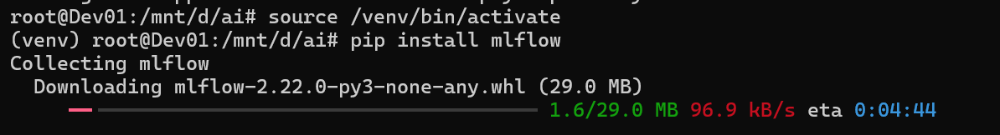
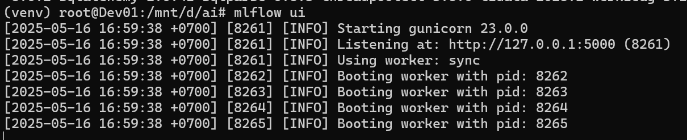
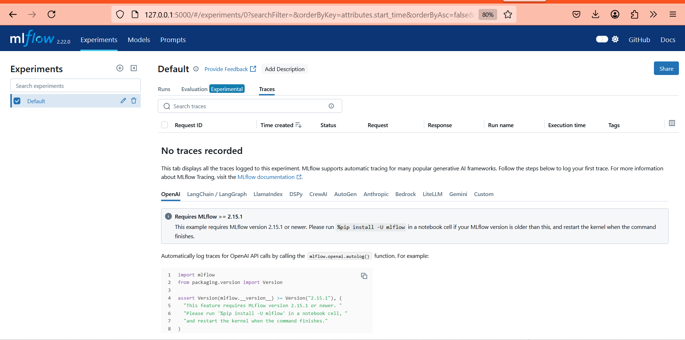
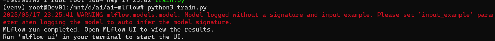
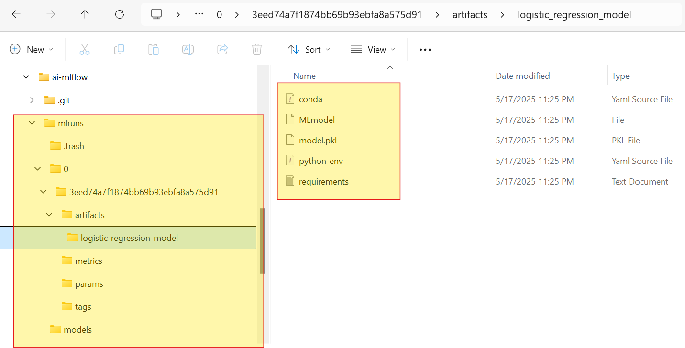
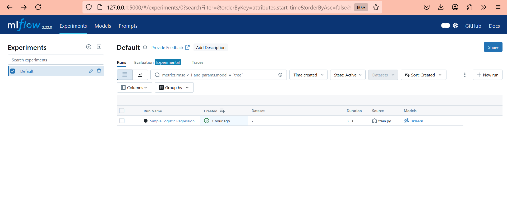
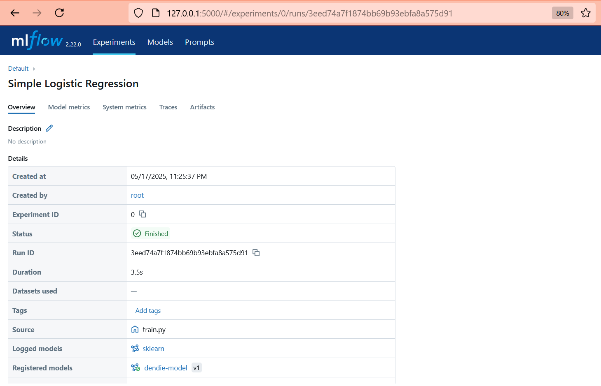
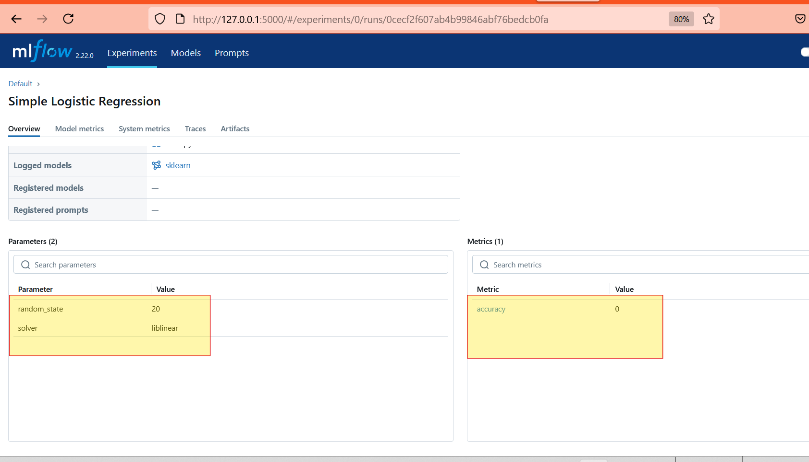
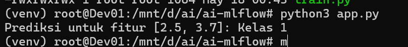

# MF-FLow: Build Pipeline MLOps

  * [1. Python Installation](https://www.google.com/search?q=%231-instalasi-python)
  * [2. Library Python MLflow Installation](https://www.google.com/search?q=%232-instalasi-library-python-mlflow)
  * [3. Training Machine Learning](https://www.google.com/search?q=%233-training-machine-learning)
  * [4. Read Information Model](https://www.google.com/search?q=%234-membaca-informasi-model)
  * [5. Test Model](https://www.google.com/search?q=%235-menguji-model)

# MF-FLow: Building an MLOps Pipeline

**MLOps** is the practice of building automated pipelines to continuously train, evaluate, and deploy Machine Learning (ML) models. It's similar to the CI/CD principles used in traditional software development. Tools like **MLflow, Kubeflow, or Airflow** are highly beneficial for implementing MLOps.

**MLflow** is an essential tool for tracking ML experiments (logging parameters, metrics, and artifacts) and managing project reproducibility. This includes **MLflow Tracking** to record your experiment results, and **MLflow Projects** to package your ML code for reproducibility across various environments. It's highly recommended to integrate MLflow into your TensorFlow and LLM workflows.


### 1\. Python Installation

Perform Python installation:

```bash
apt install python3.10-venv
python3 -m venv venv
source /venv/bin/activate
```

### 2\. MLflow Python Library Installation

Install MLflow:

```bash
pip install mlflow
```



MLflow has a User Interface (UI) that you can access at this address after execution:

```bash
mlflow ui
```






### 3\. Machine Learning Training

Run the Machine Learning training process. For example, we'll use the `train.py` file, which contains a supervised learning ML example to generate classification with tabular training data.

```bash
python3 train.py
```



The result of this training will be a model in MLflow format.



The model generated from the machine learning training will appear on the MLflow Dashboard.


### 4\. Reading Model Information

On the MLflow Dashboard, you can see the model created by MLflow








The most important aspects to monitor from the training results are the two sections highlighted in the images above:

1.  **Parameters:**
    These parameters contain the values used as settings applied during machine learning training. Each model can have different parameters, depending on the machine learning algorithm used.
2.  **Accuracy:**
    This is the accuracy value when the trained model is tested with testing data. A value of **0 (0%)** indicates a poor result, while **1 (100%)** indicates a very good result. Generally, an accuracy value of **0.9** is considered very good for tabular models, while for image-based models, **0.8** is already considered very good.


### 5\. Testing the Model

Here's how to run the model resulting from the training:




